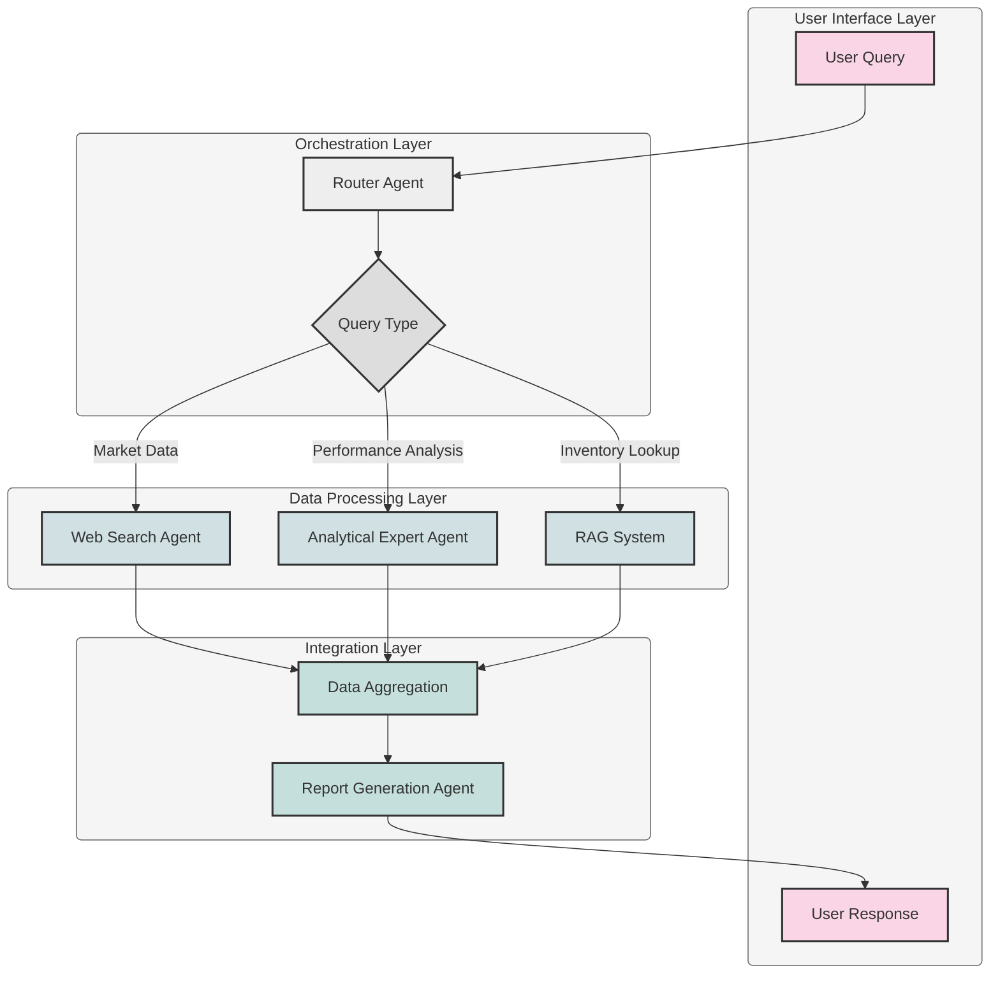

# 📦 Agentic AI RAG for Supply Chain & Logistics 🚚

---

## 🚀 Overview

This project implements an **Agentic AI Retrieval-Augmented Generation (RAG)** system designed to streamline and enhance decision-making in the **Supply Chain and Logistics** domain. Leveraging the power of large language models (specifically **Llama3-70B**), intelligent agents, and a robust vector database, this system provides users with accurate, up-to-date, and insightful information through a user-friendly chatbot interface.

## 🌟 Key Features

- **Intuitive Chatbot Interface** 💬 
  - Natural language query processing
  - Contextual conversation history
  - Rich response formatting with tables and charts

- **Intelligent Multi-Agent System** 🧠
  - **Router Agent** 🚦 - Analyzes queries and orchestrates workflow
  - **Web Search Agent** 🌐 - Gathers real-time market data and logistics news
  - **Analytical Expert Agent** 📊 - Performs in-depth data analysis
  - **Report Generation Agent** 📝 - Creates comprehensive summaries

- **Advanced RAG Capabilities** 📚
  - Semantic search across logistics documents
  - Hybrid retrieval combining keyword and vector search
  - Custom chunking for complex logistics documentation

- **Enterprise-Grade Data Integration** 🔄
  - Transportation management system (TMS) integration
  - Inventory management system connectivity
  - Real-time freight rate lookups
  - Warehouse capacity utilization tracking

- **Supply Chain Analytics** 📈
  - Demand forecasting assistance
  - Route optimization suggestions
  - Inventory level recommendations
  - Risk assessment for supply disruptions

## 🛠️ Technology Stack

| Component | Technology |
|-----------|------------|
| **LLM Backend** | Llama3-70B (via Groq) |
| **Framework** | Agenta |
| **Web Search** | DuckDuckGo API, Newspaper4k |
| **Vector Database** | Chroma DB |
| **Embeddings** | E5-large-v2 |
| **Programming** | Python 3.9+ |
| **Containerization** | Docker |
| **CI/CD** | GitHub Actions |

## ⚙️ System Architecture

## 🔄 Workflow Explanation

1. **Query Submission** 🔍
   - User submits logistics or supply chain question through chat interface
   - System captures context from conversation history

2. **Intelligent Routing** 🧭
   - Router Agent analyzes query intent and complexity
   - Determines optimal processing path and required agents

3. **Multi-Source Information Retrieval** 📊
   - **Web Search**: Real-time freight rates, fuel prices, port delays
   - **Analytics**: Historical performance data, seasonal patterns
   - **RAG**: Company-specific logistics policies, carrier guidelines

4. **Knowledge Integration** 🧩
   - Cross-reference information from multiple sources
   - Resolve conflicts between data points
   - Prioritize information based on relevance and recency

5. **Report Generation** 📄
   - Structured response with executive summary
   - Supporting data, charts, and actionable recommendations
   - Citations to source information

## 🚀 Getting Started

### Prerequisites

- Python 3.9 or higher
- Groq API key (for Llama3-70B access)
- DuckDuckGo API credentials

## 📊 Use Cases

- **Inventory Optimization** 📦
  - "What's the optimal safety stock level for product XYZ based on current lead times?"
  - "How will the port congestion in Shanghai affect our Q3 inventory planning?"

- **Transportation Planning** 🚛
  - "What carriers have the best on-time delivery rate for the Midwest region?"
  - "Compare costs between intermodal and full truckload for our West Coast shipments"

- **Supply Chain Risk Management** ⚠️
  - "Identify potential disruption risks for our semiconductor components"
  - "What backup suppliers do we have for raw materials in Southeast Asia?"

- **Performance Analytics** 📈
  - "Generate a report on warehouse efficiency trends over the past 12 months"
  - "Compare carrier performance metrics across our top 5 logistics partners"

  <b>Developed by Pritom Bhowmik</b>

